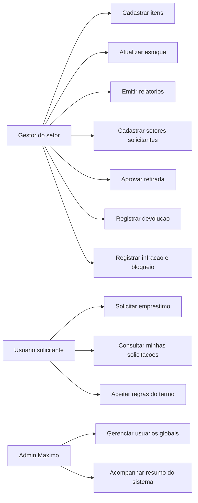
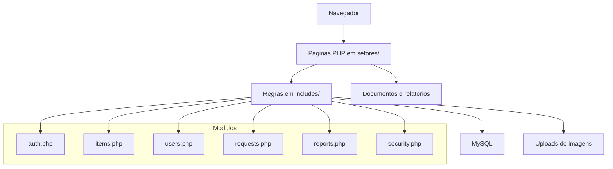
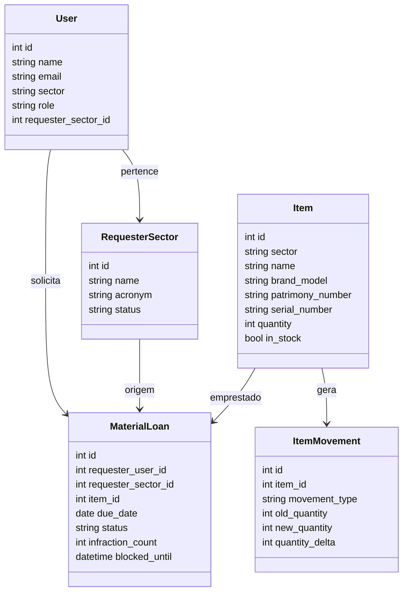
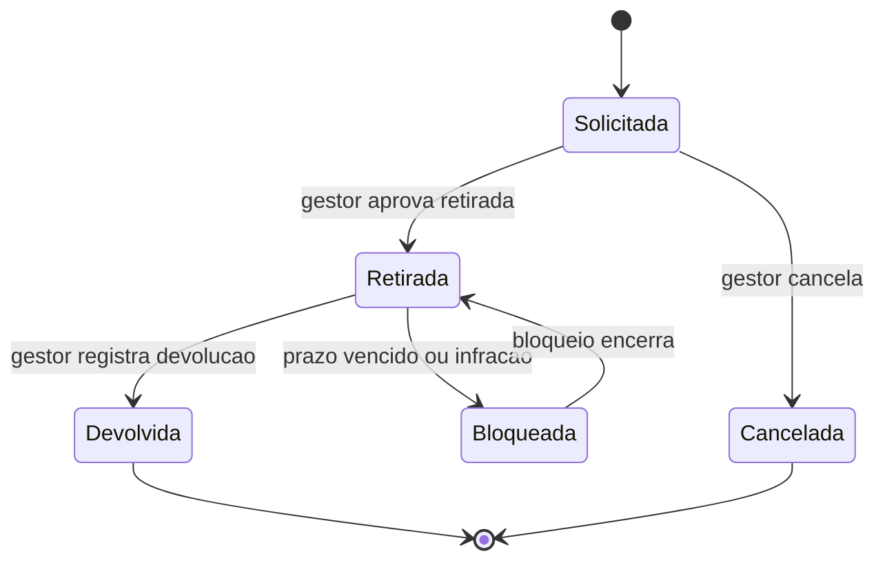

# UML - Gestao de Itens / Almoxarifado

## Casos de uso

```mermaid
flowchart LR
    Gestor["Gestor do setor"]
    Solicitante["Usuario solicitante"]
    Admin["Admin Maximo"]

    Gestor --> UC1["Cadastrar itens"]
    Gestor --> UC2["Atualizar estoque"]
    Gestor --> UC3["Emitir relatorios"]
    Gestor --> UC4["Cadastrar setores solicitantes"]
    Gestor --> UC5["Aprovar retirada"]
    Gestor --> UC6["Registrar devolucao"]
    Gestor --> UC7["Registrar infracao e bloqueio"]

    Solicitante --> UC8["Solicitar emprestimo"]
    Solicitante --> UC9["Consultar minhas solicitacoes"]
    Solicitante --> UC10["Aceitar regras do termo"]

    Admin --> UC11["Gerenciar usuarios globais"]
    Admin --> UC12["Acompanhar resumo do sistema"]
```

## Arquitetura

```mermaid
flowchart TB
    Browser["Navegador"]
    Pages["Paginas PHP em setores/"]
    Includes["Regras em includes/"]
    DB["MySQL"]
    Uploads["Uploads de imagens"]
    Reports["Documentos e relatorios"]

    Browser --> Pages
    Pages --> Includes
    Includes --> DB
    Pages --> Reports
    Includes --> Uploads

    subgraph Modulos
        Auth["auth.php"]
        Items["items.php"]
        Users["users.php"]
        Requests["requests.php"]
        ReportsModule["reports.php"]
        Security["security.php"]
    end

    Includes --> Auth
    Includes --> Items
    Includes --> Users
    Includes --> Requests
    Includes --> ReportsModule
    Includes --> Security
```

## Entidades principais

```mermaid
classDiagram
    class User {
        int id
        string name
        string email
        string sector
        string role
        int requester_sector_id
    }

    class RequesterSector {
        int id
        string name
        string acronym
        string status
    }

    class Item {
        int id
        string sector
        string name
        string brand_model
        string patrimony_number
        string serial_number
        int quantity
        bool in_stock
    }

    class ItemMovement {
        int id
        int item_id
        string movement_type
        int old_quantity
        int new_quantity
        int quantity_delta
    }

    class MaterialLoan {
        int id
        int requester_user_id
        int requester_sector_id
        int item_id
        date due_date
        string status
        int infraction_count
        datetime blocked_until
    }

    User --> RequesterSector : pertence
    Item --> ItemMovement : gera
    User --> MaterialLoan : solicita
    RequesterSector --> MaterialLoan : origem
    Item --> MaterialLoan : emprestado
```

## Fluxo de emprestimo

```mermaid
stateDiagram-v2
    [*] --> Solicitada
    Solicitada --> Retirada: gestor aprova retirada
    Solicitada --> Cancelada: gestor cancela
    Retirada --> Devolvida: gestor registra devolucao
    Retirada --> Bloqueada: prazo vencido ou infracao
    Bloqueada --> Retirada: bloqueio encerra
    Devolvida --> [*]
    Cancelada --> [*]
```
