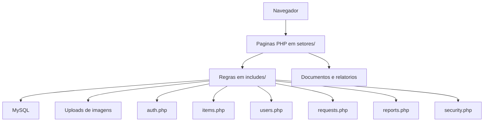

# Arquitetura

```mermaid
flowchart TB
    Browser["Navegador"]
    Pages["Paginas PHP em setores/"]
    Includes["Regras em includes/"]
    DB["MySQL"]
    Uploads["Uploads de imagens"]
    Reports["Documentos e relatorios"]

    Browser --> Pages
    Pages --> Includes
    Includes --> DB
    Pages --> Reports
    Includes --> Uploads

    Includes --> Auth["auth.php"]
    Includes --> Items["items.php"]
    Includes --> Users["users.php"]
    Includes --> Requests["requests.php"]
    Includes --> ReportsModule["reports.php"]
    Includes --> Security["security.php"]
```
