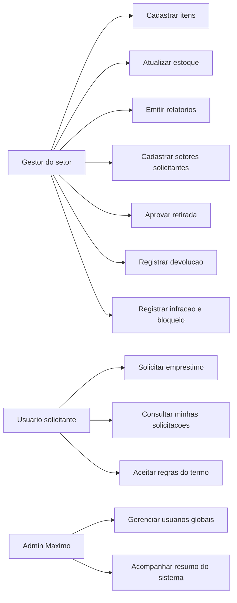

# Casos de uso

```mermaid
flowchart LR
    Gestor["Gestor do setor"]
    Solicitante["Usuario solicitante"]
    Admin["Admin Maximo"]

    Gestor --> UC1["Cadastrar itens"]
    Gestor --> UC2["Atualizar estoque"]
    Gestor --> UC3["Emitir relatorios"]
    Gestor --> UC4["Cadastrar setores solicitantes"]
    Gestor --> UC5["Aprovar retirada"]
    Gestor --> UC6["Registrar devolucao"]
    Gestor --> UC7["Registrar infracao e bloqueio"]

    Solicitante --> UC8["Solicitar emprestimo"]
    Solicitante --> UC9["Consultar minhas solicitacoes"]
    Solicitante --> UC10["Aceitar regras do termo"]

    Admin --> UC11["Gerenciar usuarios globais"]
    Admin --> UC12["Acompanhar resumo do sistema"]
```
