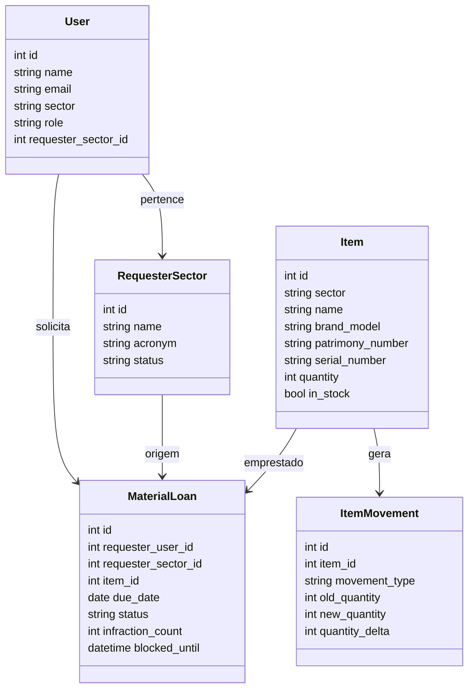

# Entidades principais

```mermaid
classDiagram
    class User {
        int id
        string name
        string email
        string sector
        string role
        int requester_sector_id
    }

    class RequesterSector {
        int id
        string name
        string acronym
        string status
    }

    class Item {
        int id
        string sector
        string name
        string brand_model
        string patrimony_number
        string serial_number
        int quantity
        bool in_stock
    }

    class ItemMovement {
        int id
        int item_id
        string movement_type
        int old_quantity
        int new_quantity
        int quantity_delta
    }

    class MaterialLoan {
        int id
        int requester_user_id
        int requester_sector_id
        int item_id
        date due_date
        string status
        int infraction_count
        datetime blocked_until
    }

    User --> RequesterSector : pertence
    Item --> ItemMovement : gera
    User --> MaterialLoan : solicita
    RequesterSector --> MaterialLoan : origem
    Item --> MaterialLoan : emprestado
```
